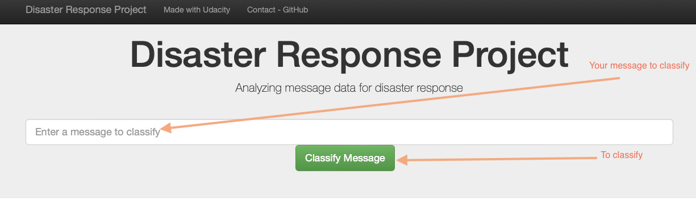

# Disaster Response Pipeline Project

### Instructions to run the project:
1. Run the following commands in the project's root directory to set up your database and model.

    - To run ETL pipeline that cleans data and stores in database
        `python data/process_data.py data/disaster_messages.csv data/disaster_categories.csv data/DisasterResponse.db`
    - To run ML pipeline that trains classifier and saves
        `python models/train_classifier.py data/DisasterResponse.db models/classifier.pkl`

2. Go to `app` directory: `cd app`

3. Run your web app: `python run.py`

4. Click the `PREVIEW` button to open the homepage or browse the following webpage : http://127.0.0.1:3000

5. To classify your message, first type it in the text field and then use the button "Classify Message".

6. Results are displayed below.

### Project structure : 

- data : contains data used to train the model and the code to load and clean input data.
- images : images used in the documentation
- models : contains the trained model and the code to train our model
- notebooks : contains the working notebooks created to prepare the data and train, test and fine tune the parameters.